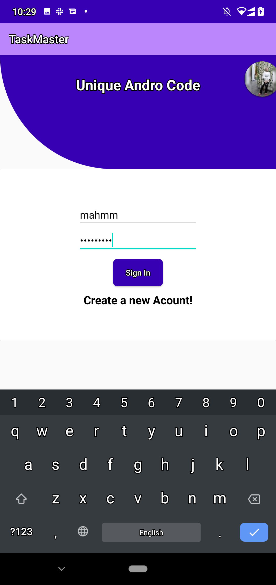
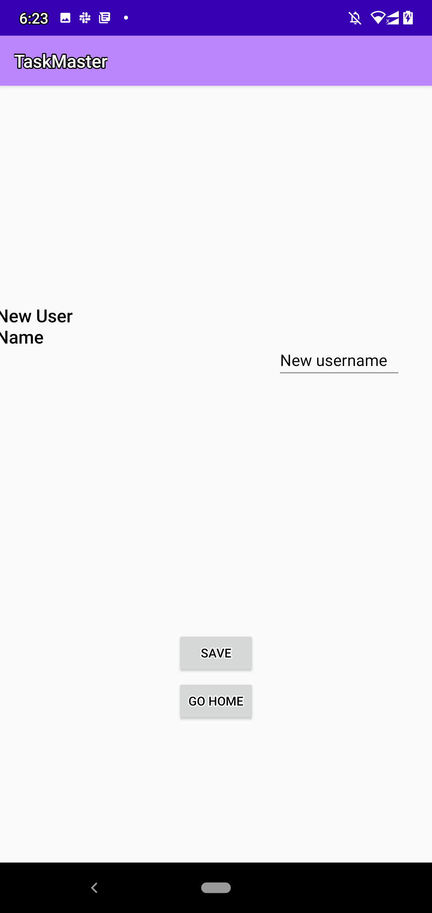

# TaskMaster

## its an android app that allow to you to sechduales and save your tasks, its like a task manager .
## mainly contains of three activites :
* Main Activity : which contains listview of tasks can click on each one of them to view the details of the task.

* Task Detail : which contains a title name and it's body and state of the task.

* Add Task Activity : allow you to add a new task with description
* All Task Activity : show all your task
* Setting Page: you can add your username.
* ## now you can save yor tasks

# awsAmazon 
## Amplify 
> Amplify initiated Successfully 

## Succefully connected Graphql and save in api 

## now you can add your task and save it cloudly on the api and restore it 

## connected with *Cognito @Auth* to secure your account 

## S3 
#### WS Amplify Storage module provides a simple mechanism for managing user content for your app in public, protected or private storage buckets. The Storage category comes with built-in support for Amazon S3. There are two ways to add storage with Amplify - manual and automated. Both methods require the auth category with Amazon Cognito to also be enabled.

## Notification 
#### Enable your users to receive mobile push messages sent from the Apple (APNs) and Google (FCM/GCM) platforms. The CLI deploys your push notification backend using Amazon Pinpoint. You can also create Amazon Pinpoint campaigns that tie user behavior to push or other forms of messaging.

## Analytics
#### The Analytics category enables you to collect analytics data for your App. The Analytics category comes with built-in support for Amazon Pinpoint and Amazon Kinesis (Kinesis support is currently only available in the Amplify JavaScript library).

# give it a look :

