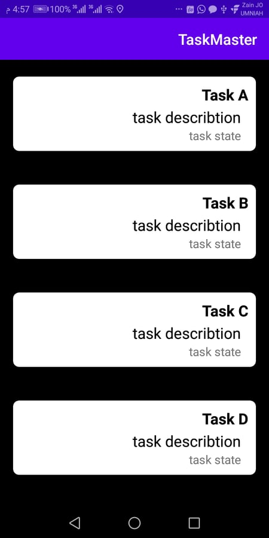

# TaskMaster

## its an android app that allow to you to sechduales and save your tasks, its like a task manager .
## mainly contains of three activites :
* Main Activity : which contains listview of tasks can click on each one of them to view the details of the task.

* Task Detail : which contains a title name and it's body and state of the task.

* Add Task Activity : allow you to add a new task with description
* All Task Activity : show all your task
* Setting Page: you can add your username.
* ## now you can save yor tasks

# awsAmazon 
## Amplify 
> Amplify initiated Successfully 

## Succefully connected Graphql and save in api 

## now you can add your task and save it cloudly on the api and restore it 

## connected with *Cognito @Auth* to secure your account 

## S3 
#### WS Amplify Storage module provides a simple mechanism for managing user content for your app in public, protected or private storage buckets. The Storage category comes with built-in support for Amazon S3. There are two ways to add storage with Amplify - manual and automated. Both methods require the auth category with Amazon Cognito to also be enabled.

## Notification 
#### Enable your users to receive mobile push messages sent from the Apple (APNs) and Google (FCM/GCM) platforms. The CLI deploys your push notification backend using Amazon Pinpoint. You can also create Amazon Pinpoint campaigns that tie user behavior to push or other forms of messaging.

## Analytics
#### The Analytics category enables you to collect analytics data for your App. The Analytics category comes with built-in support for Amazon Pinpoint and Amazon Kinesis (Kinesis support is currently only available in the Amplify JavaScript library).

## Intent-Filter 
#### An Intent is a messaging object you can use to request an action from another app component. Although intents facilitate communication between components in several ways, there are three fundamental use cases:

There are two types of intents:

Explicit intents specify which application will satisfy the intent, by supplying either the target app's package name or a fully-qualified component class name. You'll typically use an explicit intent to start a component in your own app, because you know the class name of the activity or service you want to start. For example, you might start a new activity within your app in response to a user action, or start a service to download a file in the background.
Implicit intents do not name a specific component, but instead declare a general action to perform, which allows a component from another app to handle it. For example, if you want to show the user a location on a map, you can use an implicit intent to request that another capable app show a specified location on a map.
Figure 1 shows how an intent is used when starting an activity. When the Intent object names a specific activity component explicitly, the system immediately starts that component.

Figure 1. How an implicit intent is delivered through the system to start another activity: [1] Activity A creates an Intent with an action description and passes it to startActivity(). [2] The Android System searches all apps for an intent filter that matches the intent. When a match is found, [3] the system starts the matching activity (Activity B) by invoking its onCreate() method and passing it the Intent.

When you use an implicit intent, the Android system finds the appropriate component to start by comparing the contents of the intent to the intent filters declared in the manifest file of other apps on the device. If the intent matches an intent filter, the system starts that component and delivers it the Intent object. If multiple intent filters are compatible, the system displays a dialog so the user can pick which app to use.

An intent filter is an expression in an app's manifest file that specifies the type of intents that the component would like to receive. For instance, by declaring an intent filter for an activity, you make it possible for other apps to directly start your activity with a certain kind of intent. Likewise, if you do not declare any intent filters for an activity, then it can be started only with an explicit intent.

# give it a look :

